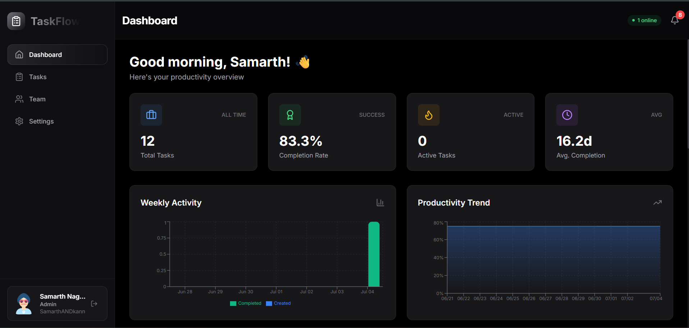
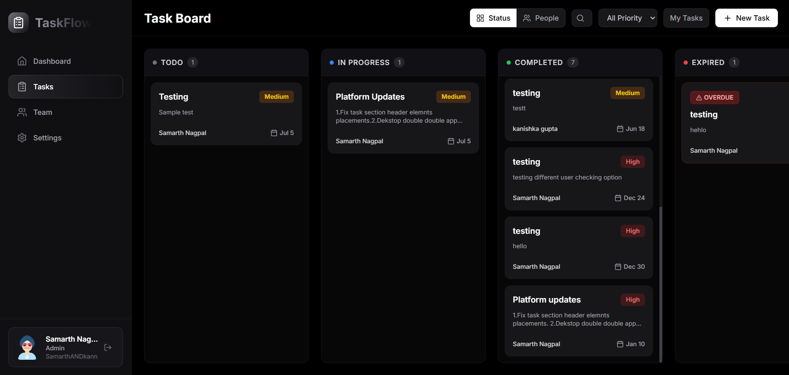
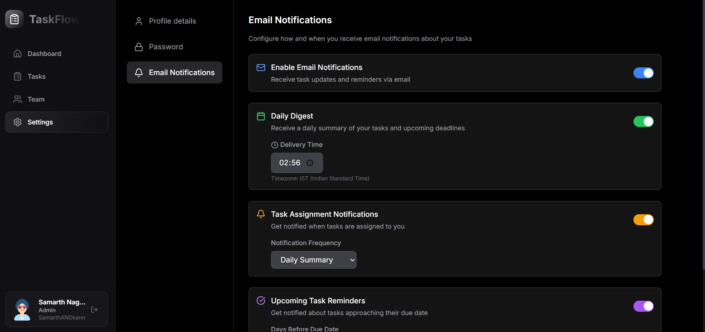

# 🏢 TaskFlow: Multi-Tenant Task Management Client

> **TaskFlow** is a modern, high-performance React 19 client application designed for multi-tenant organizations. It delivers a secure, real-time workspace for team collaboration, task tracking, interactive productivity analytics, and role-based access management.
>
> Built with **React 19**, **Vite**, **Tailwind CSS**, and **Socket.io** to provide a fast, responsive, and real-time user experience suitable for modern production environments.

---

## 📸 Project Showroom

Here is a visual walkthrough of TaskFlow in action, showcasing its core interfaces:

### 📊 1. Analytics & Activity Dashboard
An interactive central hub displaying key performance indicators, task status distributions, and team-wide productivity trends.


### 📋 2. Real-Time Kanban Board
A collaborative task board with dynamic updates. Team members can create, update, reassign, and comment on tasks with instantaneous state synchronization across all connected clients.


### ⚙️ 3. Organization & Security Settings
Comprehensive account settings, password updates, profile management, and granular email notification preferences.


---

## 🛠️ Technical Highlights (For Recruiters)

This frontend client implements several enterprise-grade patterns and engineering solutions:

*   **Real-Time Bidirectional Sync**: Integrates a custom WebSockets abstraction layer using `Socket.io-client` exposed via React Context (`SocketContext`). This synchronizes task updates (creations, edits, deletions), user presence, and system notifications instantly across all tenants without manual page refreshes.
*   **Tenant & Auth Isolation**: Utilizes a centralized Axios HTTP client with request/response interceptors. The request interceptor automatically attaches the bearer JWT token, while the response interceptor securely handles expired sessions (automatic `401` logout and redirect), maintaining strict tenant isolation.
*   **Optimized Data Fetching**: Utilizes `react-query` (TanStack Query) to manage remote API caching, background refetching, and state synchronization, reducing server load and rendering overhead.
*   **Rich-Text Task Descriptions**: Uses a customized `Tiptap` editor allowing teams to use formatted descriptions, link highlights, and clean typography when drafting deliverables.
*   **Modern UI/UX Design System**: Built with a dark-mode first, glassmorphism-influenced design using Tailwind CSS, Lucide icons, and responsive layouts to ensure a premium feel across mobile, tablet, and desktop devices.
*   **Lightweight & Production-Ready**: Cleaned of redundant boilerplate (including testing harness artifacts and Docker files) to prioritize build performance, speed up deployment, and reduce bundle size.

---

## 🎨 Technology Stack

*   **Framework & Build Tool**: React 19, Vite (configured for HMR and lightning-fast builds)
*   **Real-time Protocols**: Socket.io-client (supporting WebSocket & polling fallbacks)
*   **Styling & Icons**: Tailwind CSS, Lucide React, React Toastify (elegant, transient toast notifications)
*   **Charts & Visualizations**: Recharts (fully responsive SVG analytics rendering)
*   **Network Client**: Axios, TanStack React Query
*   **Editor**: Tiptap Starter Kit (Rich Text markup)

---

## 🚀 Getting Started

To run the application locally, follow these steps:

### Prerequisites
*   **Node.js** (version 18 or higher)
*   **npm** (Node Package Manager)

### Installation
1.  **Clone the Repository**:
    ```bash
    git clone https://github.com/your-username/Multi-Tenant-Task-Management-Frontend.git
    cd Multi-Tenant-Task-Management-Frontend
    ```

2.  **Install Project Dependencies**:
    ```bash
    npm install
    ```

3.  **Environment Setup**:
    Create a `.env` file in the root directory to point to your backend API service:
    ```env
    VITE_API_URL=http://localhost:5000/api
    ```
    *(For production builds, the project references `.env.production` where you can set the backend API and socket server endpoints accordingly.)*

### Running Locally
*   **Run Development Server**:
    ```bash
    npm run dev
    ```
    Open [http://localhost:5173](http://localhost:5173) in your browser.

*   **Production Build & Bundle Optimization**:
    ```bash
    npm run build
    ```
    This compiles assets into optimized static files inside the `dist/` directory.

*   **Preview Production Build locally**:
    ```bash
    npm run preview
    ```

---

## 📂 Architecture & Directory Structure

```text
Multi-Tenant-Task-Management-Frontend/
├── public/                 # Static assets (favicons, browser configurations)
└── src/
    ├── assets/             # Images, project screenshots, and visual branding assets
    │   ├── taskflow1.png   # Dashboard screenshot
    │   ├── taskflow2.png   # Kanban board screenshot
    │   └── taskflow3.png   # Account settings screenshot
    ├── components/         # Reusable presentation and layout components
    │   ├── Layout.jsx      # Global layout shell with navigation
    │   ├── ProtectedRoute.jsx # Route guard for authentication state
    │   ├── RichTextEditor.jsx # Tiptap rich-text wrapper
    │   └── ... (Modals for invitation, reassignment, editing, etc.)
    ├── context/            # Global state context providers
    │   ├── AuthContext.jsx # Handles JWT session management
    │   └── SocketContext.jsx # Handles real-time connection and online presence state
    ├── pages/              # Main route views
    │   ├── Dashboard.jsx   # Interactive charts and real-time statistics
    │   ├── Tasks.jsx       # Task list & collaborative Kanban board
    │   ├── Team.jsx        # Org member lists, role management, and invitation console
    │   ├── Settings.jsx    # Tenant details, password, and preferences configuration
    │   └── AcceptInvitation.jsx # Welcome/onboarding screen for new tenants
    ├── services/           # External service configurations
    │   └── socketService.js # Singleton socket event emitter/listener service
    ├── utils/              # Utility configurations and API abstractions
    │   └── api.js          # API client instance (Axios interceptors) & backend route registry
    ├── App.jsx             # Routes declaration and global Toast container initialization
    ├── index.css           # Global CSS variables and Tailwind style configurations
    └── main.jsx            # React root mount entry point
```

---

## 📤 Deployment & Vercel Configuration

This repository includes a custom `vercel.json` configuration designed to support SPA client-side routing. This ensures that direct page loads (e.g. `/dashboard` or `/settings`) routing through React Router resolve correctly to `index.html` without yielding a 404 error.

To deploy:
1. Connect your repository in Vercel.
2. Ensure the Framework Preset is set to **Vite**.
3. Add the required Environment Variables in the project console (`VITE_API_URL` and `VITE_SOCKET_URL`).
4. Trigger the build pipeline.
